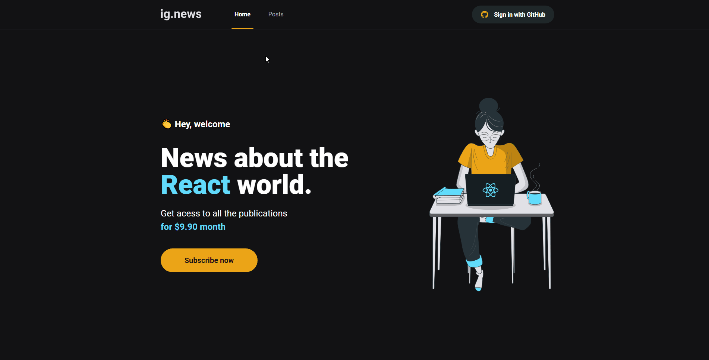

<p align="center">

</p>

<p align="center">📓 An simple blog project that integrates Prismic, Stripe and Next JS</p>

Table of contents
=================
<p align="center">
  <a href="#about">About</a> •
  <a href="#tecnologies">Tecnologies</a> •
  <a href="#pre-requirements">Pre-requirements</a> •
  <a href="#running-the-project">Running the project</a> •
  <a href="#contributors">Contributors</a> •
  <a href="#author">Author</a>
</p>

-------


<h3 align="center">🚧 Some adjustments to do 🚧</h3>

## **About**
</img>

The intent of this project is only practicing some concepts of Next.js and dicover more about the Prismic API and Stripe SDK

## Tecnologies

The following technologies were used at this project:

- [React](https://pt-br.reactjs.org/)
- [Next.js](https://nextjs.org/)
- [Prismic CMS](https://prismic.io/)
- [Stripe](https://stripe.com/)
- [Sass](https://sass-lang.com/)
- [TypeScript](https://www.typescriptlang.org/)
- [FaunaDB](https://fauna.com/)

## **Pre-requirements**

First of all you will need these tools:
[Git](https://git-scm.com), [Node.js](https://nodejs.org/en/), [Yarn](https://yarnpkg.com/)

## **Running the project**

### Pre Requisites

As this project has the main focus on the frontend all the backend stack was made using external services, because of that to run this project you are going to need to register on these services (all of these service has a really good free tier)

To start you will have to duplicate the file `.env.local.example` and rename it to `.env.local`, after that you are going to need the following tools:

#### Stripe

At Stripe you are going to need only the API key for a specific project, so all you are going to need is to get at the `Developers` page from stripe the `API key` and fill the field `STRIPE_API_KEY` at the `.env.local` file.

You also is going to need a public api key (normally it is something like `pk_{NAME}_{CODE}`) this key is needed to load some public infos from your Stripe product, like its name and price, after the creation of that key you place it at `NEXT_PUBLIC_STRIPE_PUBLIC_KEY`.

#### FaunaDB

First you need to register at this service, this service is responsible for the database of this project.

After you create an account you will need to create an database in the region you want, when i created this project the only DB available was the classic, but feel free to test the other ones.

After you have your DB created you will need to go to the `Security` page and create a key for your access
and with that key you can fill the `FAUNA_DB_KEY` at `.env.local`

### Running the frontend

This project is completely built using only the frontend, the backend stack was made using external services, so you will just need to run these commands to get you development ambient running:

```bash
# Clone this repo
$ git clone <https://github.com/GbCarvalho/ignews>

# Access the folder of the cloned repo
$ cd ignews

# Install all dependencies
$ yarn

# Execute the application in the dev mode
$ yarn dev

# The server will be initialized at the port 3000 - access <http://localhost:3000>
```


## **Contributors**

This is an sample project but every contribution is welcome!

## **Author**

Made with ❤ by Gabriel Carvalho, Get in contact!

[](https://www.linkedin.com/in/gcb/) 
[](mailto:braga.gabrielcarvalho@gmail.com)
[](https://app.rocketseat.com.br/me/gc)